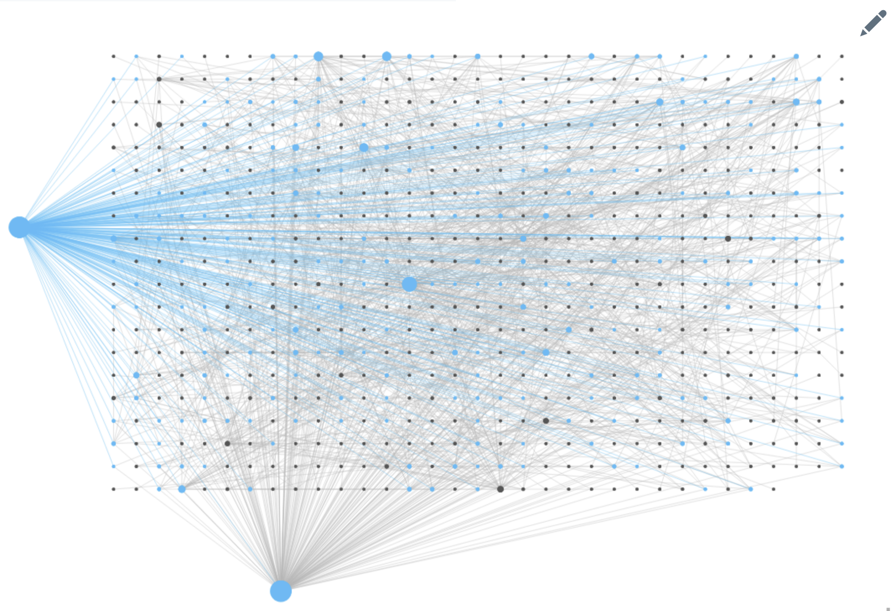

a python CLI program that aggregates all your unlinked references in one page. It takes your database in Markdown and outputs a markdown note of all your unlinked references.

Roam gives a way to find all linked references. We all use that. It also gives you a way to find all unlinked references. But to find those, you need to be in the referenced page. What if you want to do the opposite and see which pages this page references. This program does that. It shows you the unlinked references from the page they're referenced in. 

This is useful in case you import book highlights,  articles, or web-scrape long form data into Roam, like me (more on that below). Sometimes, you don't want to go over these highlights or full articles to find references. 

I web scrape a 40-pages governmental meeting report every week. It includes all the tenders and contracts in the government. It's a good way track tenders as they're the most popular form of corruption where I come from (Yes, I use Roam to fight corruption.) The meeting include mentions of ministries (departments), companies and institutions. In order to link all the entities mentioned in the meeting you'll have to go to each page and link them. With this script, I can find all of them in the 'linked references' section.

### Usage
- Clone the repo. 
- Export your database in Markdown format.
- Move the database folder to the same directory of the '.py' file.
- You're ready to the run the script:
	-  `python uref_aggregation.py [databse name]`
- The output is a markdown file you can import to Roam.

### Notes:
- The database folder must be in the same directory of the '.py' file.
- The program doesn't link all your references. It just tells you where your unlinked references are.

### Bugs and issues:
- It makes the graph overview really bad. The huge blue dots in the screenshot below are the outputs of this program when I was testing it. Yes, It's ugly.

- There are still unnecessary links in the page. For example: It still references 'google' even though we know these are just images.

Feedback is appreciated!
